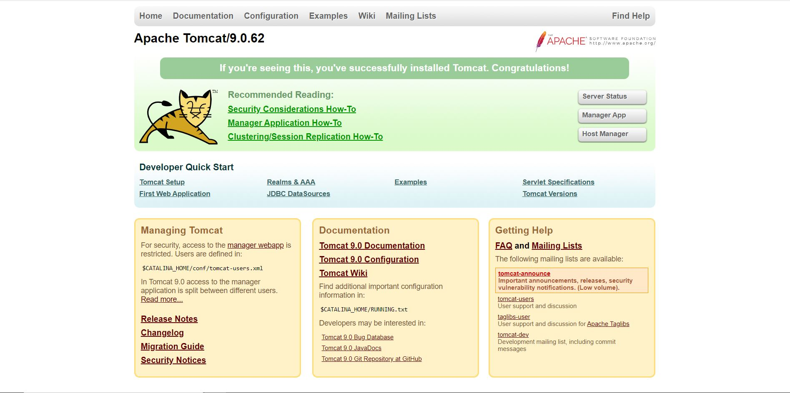
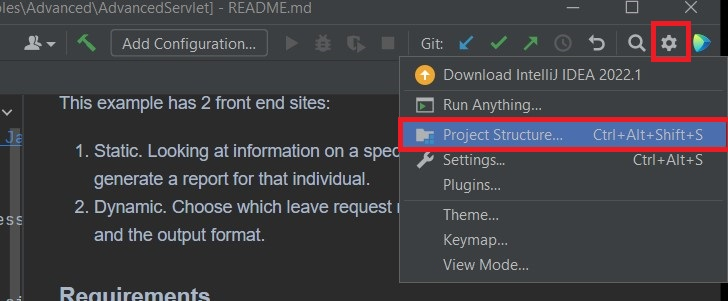
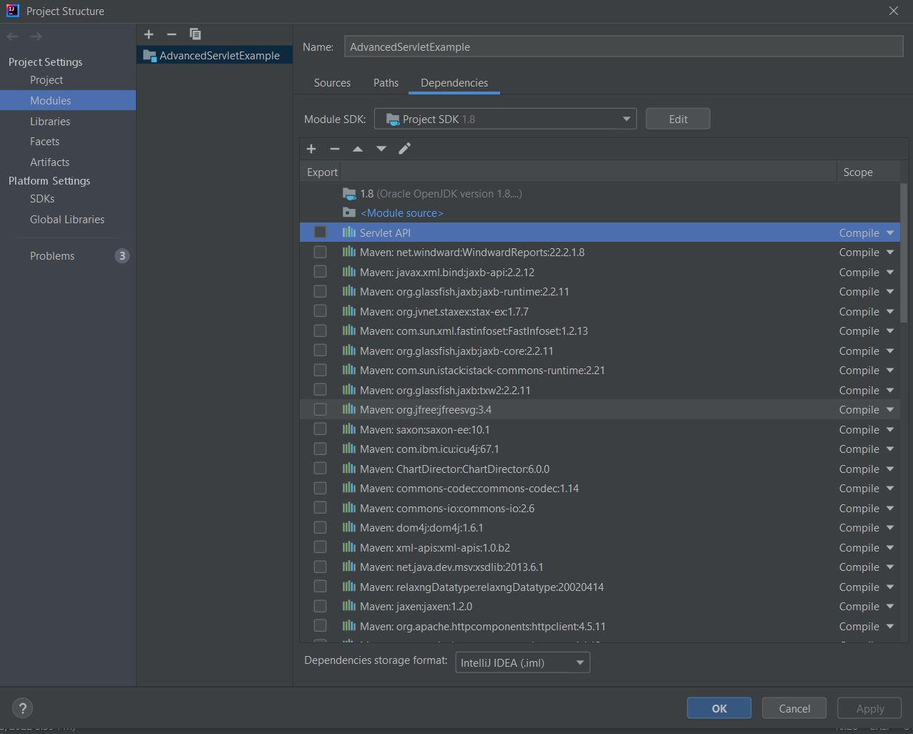
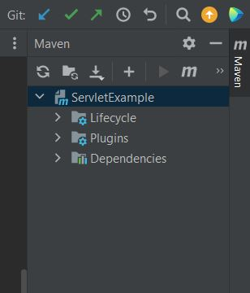
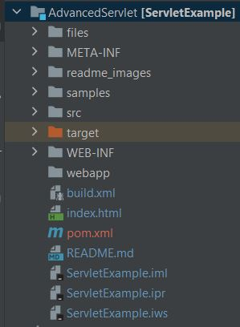
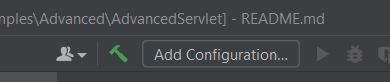
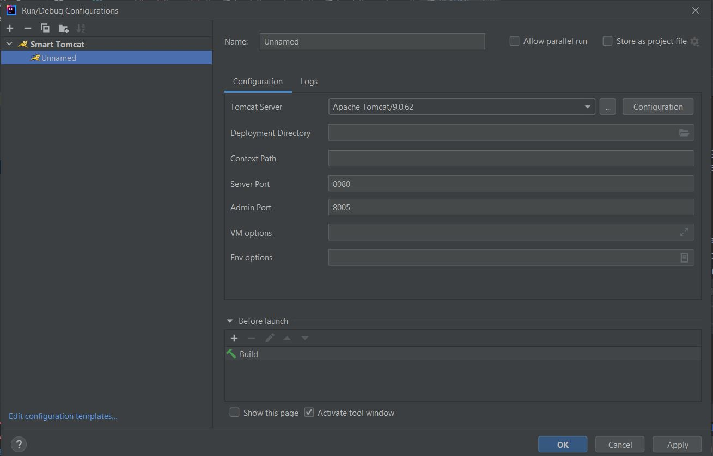
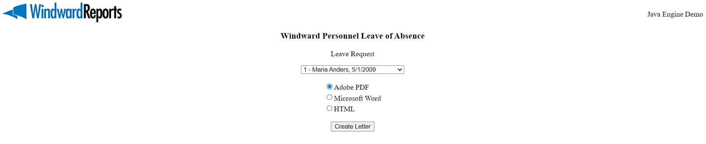
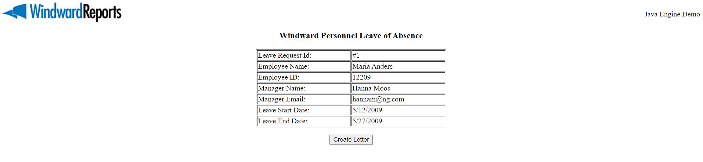

# Overview
This is a basic example on how to use the [Windward Reports Java Engine](https://www.windwardstudios.com/version/version-downloads) in a web application. This example is a pure servlet implementation (no JSPs or EJBs).

# Basic Information
The instructions are for Windows systems but the setup process is similar for any other system which Tomcat supports.

### Requirements
- [Java SE JDK 18+](https://www.oracle.com/java/technologies/downloads/) 32 or 64 bit will work
- [Tomcat 9](https://tomcat.apache.org/download-90.cgi)
- [IntelliJ](https://www.jetbrains.com/idea/)
- [Smart Tomcat Plugin](https://plugins.jetbrains.com/plugin/9492-smart-tomcat) IntelliJ plugin
- [Valid License Key](https://www.windwardstudios.com/trial/download)
- [Maven Plugin]() 

# Setup

### Set the **JAVA_HOME** path environment variable.
1. Click on the bottom search bar in the task bar.
2. Type "environment variables" and click on "Edit the System Environment Variables"
3. Under "System Variables" look for the **JAVA_HOME** variable.
    - If it **does not exist**, click "New...", then set **JAVA_HOME** for Variable Name and the path of your jdk installation for the Variable Value
    - If it **already exists**, click "Edit..." and ensure that it points to the path of the jdk installation.

# Tutorial

### Verify Tomcat 
1. Download [Tomcat 9](https://tomcat.apache.org/download-90.cgi) and using the __Core Zip__ distribution
2. Unzip the file to your `C:` Directory as `tomcat9`.
3. Navigate to the `C:/tomcat9/bin` and run the `startup.bat` file.
4. Navigate to [http://localhost:8080/](http://localhost:8080/) and verify tomcat runs successfully.

5. From the `C:/tomcat9/bin` folder run the `shutdown.bat` file.

### Set up the Project
1. Open the `AdvancedServletExample.ipr` project using IntelliJ
2. Navigate to the project structure 

3. Verify the correct Java SDK is selected and the **Servlet API** from the Tomcat zip are pointing to the correct location. 

Note: The dependencies that contain the word **Maven** will appear later in the tutorial.

### Setting the License Key
1. From inside the `AdvancedServlet` folder navigate to the `WEB-INF` folder and open the `WindwardReport.properties` file.
2. Replace `[[LICENSE]]` with your license key

### Load the Maven dependencies
1. In the top toolbar, navigate to **View** -> **Tool Windows** -> **Maven**

2. Click the left arrow icon under Maven to reload projects to bring in the Windward Java Engine.

### Verify Windward Maven Repo
1. Right-click on **AdvancedServlet** in the Project Window 

2. Then on the bottom, go to **Maven** -> **Reload project** to bring in the Windward Java Engine.

### Configuring and Running the Smart Tomcat Plugin
1. The Smart Tomcat plugin can be installed by using the link in the requirements section or follow the Intellij docs on [managing plugins](https://www.jetbrains.com/help/idea/managing-plugins.html)
2. Select **Edit Configuration...** on the top of the IntelliJ window 

3. Click the **+** sign on the left corner to add a new configuration and select Smart Tomcat which display the configurations 

4. Set the **Name** as **JavaServletExample**
5. If **Tomcat Server** is not set, then click the "..." and select the Tomcat folder at `C:/tomcat9`
6. For **Deployment Directory**, click on the folder icon and find the path of your current project and set the path to the folder that contains the WEB-INF folder.
   1. In the default case this is the "AdvancedServlet" folder
7. Change the **Context Path** to **/JavaServletExample** if not already set
8. Click **Apply** and then **OK**
9.  The **Edit Configuration...** will now be set to **JavaServletExample**
10. Click the play button to run the configuration

### Testing the Sample
1. Navigate to [http://localhost:8080/JavaServletExample](http://localhost:8080/JavaServletExample)
2. Scroll down to "Testing the sample" and click on the first sample
3. Click "Create Letter" to run and open the report
4. Return to [http://localhost:8080/JavaServletExample](http://localhost:8080/JavaServletExample)
5. Scroll down the "Testing the sample" and click on the second example
6. Choose a name from the dropdown and choose a report output
7. Click "Run Report" to run and open the report.

---

This example has 2 front end sites:
1. Example two is __dynamic__ and has the option to select an employee and output format for the generated report.

2. Example one is __static__ and generates a report based on a specific employee.

